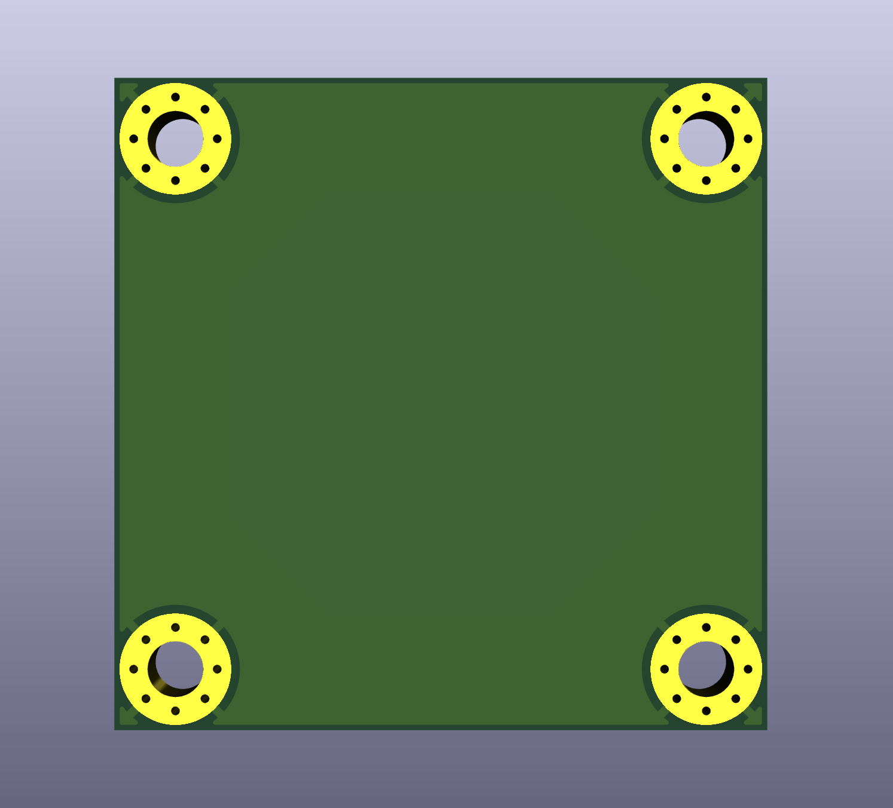

# KiCAD 30.5 x 30.5 mm mounting pattern PCB template
PCB template with just edge cuts and 4 grounded M3 mounting holes.
Distances are picked so that copper-to-edge distance comes out to 0.3 mm, which is allowed by most PCB fabs.

